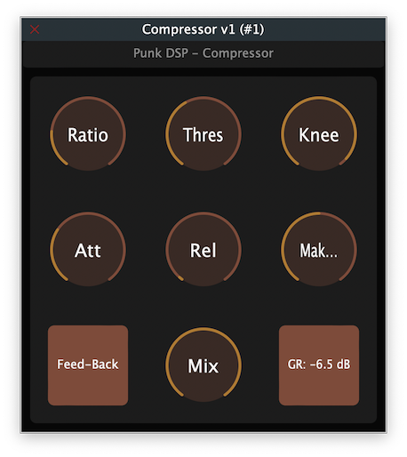

# Compressor
A JUCE audio plugin to showcase the behaviour of the compressor model in my module: punk_dsp

## Introduction
This is a VST3/AU compressor plugin made with [JUCE](https://juce.com/). The sole purpose of this plugin is to showcase and test the performance of my `Compressor` class in [punk_dsp](https://github.com/gmoican/punk_dsp).

## Plugins that make use of this compressor
* [PunkOTT](https://github.com/gmoican/PunkOTT) and [PunkOTT-MB](https://github.com/gmoican/PunkOTT-MB), my take on OTT-style processors.

